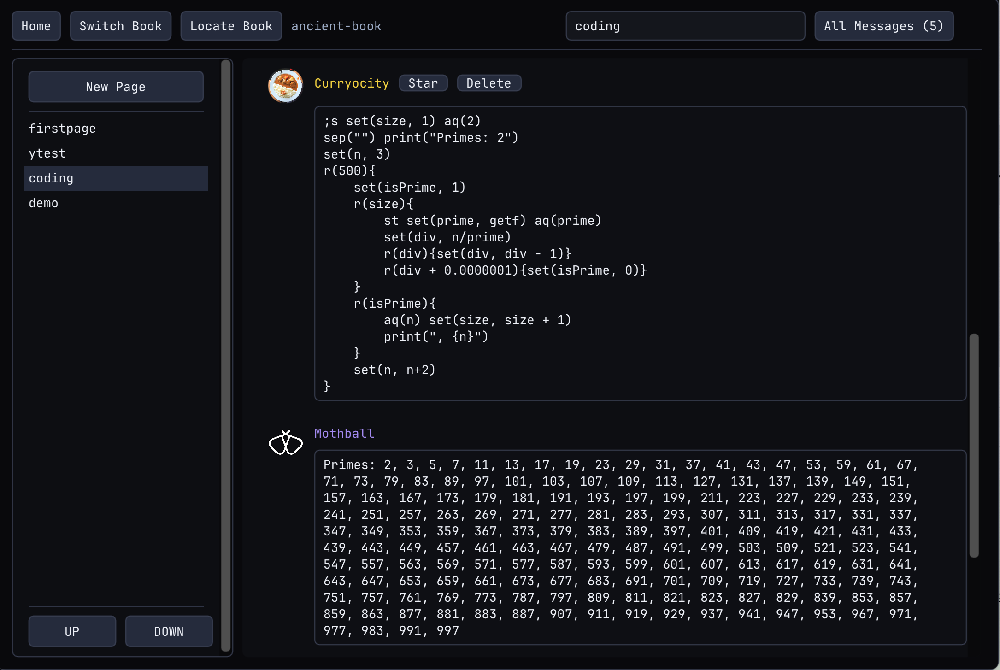
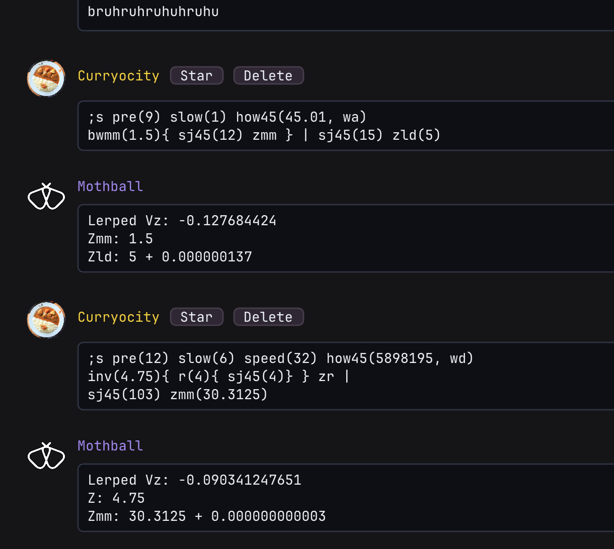

# Mothmotica 

Mothball awakened, this project won't be mothballed.

**This is a Mothball language editor, Credits:**
- Original [Mothball](https://github.com/CyrenArkade/mothball) (by CyrenArkade)
- [Extended Mothball](https://github.com/anon-noob/mothball) (forked, by Anonnoob)
- [MothballApp2](https://github.com/anon-noob/mothballapp2) (by Anonnoob)

Mothmotica adds more stratfinding features to the existing mothball, the syntax was also modified to make more sense in a PC editor (the original mothball syntax is more suitable for discord/mobile users)

Like Odin, the language it is implemented in, Mothmotica emphasizes clarity, simplicity, and **the joy of Mothballing.**

> If you encounter any bugs or want to request a feature, contact me on Discord: `Curryocity#0601`.




> **Please use** Mothball to simulate minecraft movement. **Do not** use Mothball to find prime numbers. I am **warning you**, Curryocity.



> Thank you.

## Table of Contents

- [Installation](#installation)
- [Configuration](#configuration)
- [Exporting Macros](#exporting-macros)
- [Modified Mothball](#modified-mothball-compared-to-anonnoobs-extended-mothball)

## Installation

Download the latest release for your platform, then extract the archive.

Each artifact contains the GUI app, the CLI, assets, README, and license.

### Launching

On Windows:

1. Download `mothmotica-vX.X.X-windows-x86_64`.
2. Extract the archive.
3. Open the extracted folder.
4. Run `mothmotica-gui.exe`.

On Linux:

1. Download `mothmotica-vX.X.X-linux-x86_64`.
2. Extract the archive.
3. Open a terminal in the extracted folder.
4. Run `./mothmotica-gui`.

On macOS:

1. Download `mothmotica-vX.X.X-macos-arm64` for Apple Silicon, or `mothmotica-vX.X.X-macos-x86_64` for Intel.
2. Extract the archive.
3. Open the extracted folder.
4. Right-click `Mothmotica.app`, choose **Open**, then confirm.

The macOS app is ad-hoc signed for packaging, not notarized, so the right-click **Open** step may be needed on first launch.

For CLI use, run the bundled `mothmotica-cli` binary from a terminal.

## Configuration

Open **Settings** from the Mothmotica home screen. Changes are saved automatically in Mothmotica's application data directory.

| Setting | Description |
| --- | --- |
| Name | The name shown for your messages. |
| Bot Name | The name shown for Mothball responses. |
| Profile Picture | Enter an image path and select **Use Image**, or select **Delete** to remove the current picture. |
| Mpk Directory | The destination for Mpk (`.csv`) macro exports. Press **Default Mpk** restores the default directory and **Locate Mpk** opens the active folder. |
| Cyv Directory | The destination for Cyv (`.json`) macro exports. Press **Default Cyv** restores the default directory and **Locate Cyv** opens the active folder. |
| Send Hotkey | Choose whether Enter or Shift + Enter sends a message. The other key will create a newline instead.|
| Theme | Choose the Dark, Soft, or Light theme. |

When no custom macro directory is set, both formats use the shared `Mothmotica/Macros` folder inside the platform's application data directory.

## Exporting Macros

Macro export is available for XZ simulations beginning with `;s` and XYZ/Elytra simulations beginning with `;e`.

To export from the GUI:

1. Enter or open an `;s` or `;e` simulation in a message box.
2. Right-click the message box to open **Export Macro**.
3. Enter the macro name and select **Mpk** or **Cyv**.
4. Check the input and destination, then select **Export**.

If the destination already contains a macro with the same name, choose **Cancel** to keep editing or **Overwrite** to replace it.


## Modified Mothball (Compared to Anonnoob's extended mothball)

### Minecraft versions

Mothmotica supports exact movement profiles for Minecraft 1.8.9 and 1.21.3. The `;s` and `;y` simulators default to 1.8.9, while `;e` defaults to 1.21.3.

| Command | What it does |
| --- | --- |
| `version()` / `v()` | Output the current version and all supported versions. |
| `version("1.21.3")` / `v("1.21.3")` | Select a supported version and apply its movement defaults. |
| `sdel(0/1)` | Disable or enable the one-tick airborne sprint delay. |
| `sndel(0/1)` | Disable or enable the one-tick sneak-input delay. |

Version 1.8.9 defaults to `inertia(0.005)`, `sdel(1)`, and `sndel(0)`. Version 1.21.3 defaults to `inertia(0.003)`, `sdel(0)`, and `sndel(1)`. Commands after `version(...)` can override those defaults.

Elytra simulations require Minecraft 1.21.3, so `version("1.8.9")` is rejected in `;e`. Slow Falling is unavailable in Minecraft 1.8.9, and `sf(...)` returns an error when that version is selected.

### Elytra XYZ simulator (`;e`)

See [Elytra.md](Elytra.md) for the complete `;e` simulator documentation, command reference, and examples.

### Better `;y`

By starting the command with `;y` instead of `;s`. The mothball context is set to the Y simulator. Here are the common `;y` command and its meaning:

| Command | What it does |
| --- | --- |
| `j(n)` / `jump(n)` | Jump on first tick, coast for rest. |
| `c(n)` / `coast(n)` | Coast for `n` ticks. |
| `y(n)` | Set feet Y |
| `vy(n)` | Set vertical velocity |
| `outy` / `yr` | Output feet Y |
| `outvy` | Output vertical velocity |
| `ytop` | Output head/top Y, i.e. `y + height` |
| `height(n)` | Set player height (default 1.8) |
| `jb(n)` / `jumpboost(n)` | Set jump boost level |
| `sf(0/1)` / `slowfall(0/1)` | Disable/enable Slow Falling for versions that support it. |
| `obs(0/1)` / `observe(0/1)` | Disable/enable automatic peak, ceiling, and slime messages |
| `jto(n)` / `jumpto(n)` | Jump, then simulate until landing on ground Y `n` |
| `cto(n)` / `coastto(n)` | Coast until landing on ground Y `n` |
| `cq(...)` / `ceilq(...)` | Queue ceiling heights |
| `sq(...)` / `slimeq(...)` | Queue slime block heights |
| `tier` | Output the current Y range for the next tick |

Finding the airtime for -1 and -5 drop, and the height ranges that has the same airtime:

```
;y jto(-1) tier cto(-5) tier
```

Output:

```
Peak y = 1.249187 (t = 6)
Landed y = -1 (+14t)
Tier Y-Range: (-0.860365, -1.445374)
Landed y = -5 (+5t)
Tier Y-Range: (-4.439201, -5.344633)
```

**Ceilings and slime blocks are queued events.**

For `jto/cto` command, the landing is only registered if slime queue is empty .

Mothmotica expects player to finish bouncing before landing.

jump at y = 1.5, bounce at y = 0 and y = 0.0625, coast until landing at y = 1.5

```
;y y(1.5) slimeq(0, 0.0625) jto(1.5) outy(1.5)
```

Output:

```
Peak y = 2.749187 (t = 6)
Slime y = 0 (t = 16)
Peak y = 2.101691 (t = 23)
Slime y = 0.0625 (t = 31)
Peak y = 1.509956 (t = 37)
Landed y = 1.5 (+37t)
Y: 1.5 + 0.009956
```

If you think it is too noisy, do `observe(0)` ( alias `obs(...)`).

```
;y obs(0) y(1.5) slimeq(0, 0.0625) jto(1.5) outy(1.5)
```

Output:

```
Landed y = 1.5 (+37t)
Y: 1.5 + 0.009956
```


Test the airtime of 3bc -0:

```
;y cq(3) jto(0) mes
```

Output:

```
Ceil y = 3 (t = 6)
Landed y = 0 (+11t)
(y, vy) = (0.054893, -0.447498)
```

### Use `{}` for code block:

In original mothball, the repeat function `r(...)` had such syntax:

```
r(strat, times)

Example:
r(sj(3) s.wa sa(8) outz outx x(0), 50)
```

In the example above, the entire `sj(3) s.wa sa(8) outz outx x(0)` is treated as an argument, strat. However, it consists of several commands, and several "identifiers" should really be separated by comma. But they are separated by spaces here, it is clearly a different structure.

In **Mothmotica**:

```
r(times) {strat}

Example:
r(50){
    sj(3) s.wa sa(8) outz outx x(0)
}
```

### Explicit `inv()`:

Mothmotica uses `inv(n){...}` as the base inverse command. It also keeps `bwmm(n){...}` as a historical Mothball shortcut:

| Command | Expands to |
| --- | --- |
| `bwmm(n){...}` | `inv(n + bx){...}` when `n >= 0`, `inv(n - bx){...}` when `n < 0` |

`bwmm` is syntax sugar because it was the most popular function in Mothball. For new explicit code, prefer the general `@mm`, `@b`, and `@ld` argument modifiers.

The general form is to use `@mm`, `@b`, or `@ld` inside an expression:

| Argument Prefix Modifier | Expands to |
| --- | --- |
| `@mm n` | `n + bx` when `n >= 0`, `n - bx` when `n < 0` |
| `@b n` | `n - bx` when `n >= 0`, `n + bx` when `n < 0` |
| `@ld n` | `n + bx/2` when `n >= 0`, `n - bx/2` when `n < 0` |

This avoids adding every `x` and `xz` variant. For example:

```
xzinv(@mm -1, @b 1){...}
```

is the same as:

```
xzinv(-1-bx, 1-bx){...}
```

### Savestates:

Look at this:

```
;s inv(@mm 5){ sj45(12) sj45(12)} | 
save("mm") 

print("Normal:") 
poss(0.01){sj45(25)}

print("Ladder:") load("mm") 
poss(0.01, bx/2){sj45(25)}

print("Blockage:") load("mm") 
poss(0.01, 0){sj45(25)}
```

Output:
```
Lerped Vz: -0.249583
Normal:
Poss: (t = 1...25, thres = 0.01)
t = 2: 1.5 + 0.000551
t = 6: 2.875 + 0.007956
t = 10: 4.1875 + 0.006573
t = 17: 6.375 + 0.005338
t = 23: 8.1875 + 0.001976
Ladder:
Poss: (t = 1...25, thres = 0.01)
t = 9: 3.5625 + 0.009111
t = 19: 6.6875 + 0.00077
Blockage:
Poss: (t = 1...25, thres = 0.01)
t = 3: 1.25 + 0.004408
t = 5: 1.9375 + 0.007608
t = 8: 2.9375 + 0.008328
t = 20: 6.6875 + 0.002733
```

In this particular example, the savestate could be replaced by storing the velocity in a variable and resetting the vz to that variable.(Although savestate is more readable) 

But there is so much more you can do with savestates.

### Powerful Player Set/Output Functions

| Command | What it does |
| --- | --- |
| `\|` | `pos(0, 0)` |
| `\|\|` | `pos(0, 0)` + `vel(0, 0)` |
| `x(n)` | Set `X = n` |
| `z(n)` | Set `Z = n` |
| `pos(n, m)` | Set `(X,Z) = (n, m)` |
| `vx(n)` | Set `Vx = n` |
| `vz(n)` | Set `Vz = n` |
| `vel(n, m)` | Set `(Vx,Vz) = (n, m)` |
| `f(n)` | Set `facing = n` degrees |
| `tu(n)` | Turn facing by `n` degrees |
| `xr` / `outx` | Output `X` |
| `zr` / `outz` | Output `Z` |
| `xb` | Output `X` offset outward by `bx` |
| `zb` | Output `Z` offset outward by `bx` |
| `xmm` | Output `X` offset inward by `bx` |
| `zmm` | Output `Z` offset inward by `bx` |
| `xld` | Output `X` offset outward by `bx/2` |
| `zld` | Output `Z` offset outward by `bx/2` |
| `outvx` | Output `Vx` |
| `outvz` | Output `Vz` |
| `vec` | Output speed and angle |
| `outa` | Output movement angle |
| `outf` | Output facing |
| `outtu` | Output turn/facing |

### `print()/println()`, `sep()`, `silent()`, and `mes()`

`print()` accepts multiple arguments and prints their text or values without adding a newline.

`println()` does the same thing and adds a newline.

Arguments are separated by `sep()`, which defaults to a single space. `sep()` resets the separator to a single space, and `sep("")` removes the separator.

`silent(1)` suppresses generated helper messages such as inverse lerp results and Y-sim landing/observer messages. Intentional output commands like `print(...)`, `println(...)`, `outvy`, and other `out...` commands still print. Use `silent(0)` to turn those helper messages back on.

Like:

```
;s 
set(i,0) set(a,0) set(b,1) 
sep("")
println(i,"th fibonacci: ",a)
set(i,i+1)
println(i,"th fibonacci: ",b) 
r(8){
    set(i,i+1) set(c,a+b) 
    println(i,"th fibonacci: ",c) 
    set(a,b) set(b,c)
}
```

Output:
```
0th fibonacci: 0
1th fibonacci: 1
2th fibonacci: 1
3th fibonacci: 2
4th fibonacci: 3
5th fibonacci: 5
6th fibonacci: 8
7th fibonacci: 13
8th fibonacci: 21
9th fibonacci: 34
```

`mes()` (full name `measure()`) is really good for debugging

It accepts multiple variables like `mes(var1, var2, var3)`
And it outputs like `(var1, var2, var3) = (3.5, -4, 0.67)` in a single line.

Apart from variables, you can put in built-in identifier `x/xb/xmm/xld/z/zb/zmm/zld/vx/vz/f/tick` to measure the state of the player. Like:

```
;s f(15) wj.wd sa.wd(11) s.wd mes(x,z,vx,vz)
```

Output:
```
(x, z, vx, vz) = (-1.507294, 0.870365, -0.274478, 0.158493)
```

**`mes` without arguments is equivalent to `mes(x,z,vx,vz)` in `;s` context. And `mes(y,vy)` in `;y` context.**

### Explicit speed-type support: `gnd` and `air`

From the original mothball README:

> Finding the speed required for a 5 block, no 45: `sta speedreq(5, sj(12)) b`. Note the sta before the speedreq. This is to make the player start midair, since mothball usually assumes the player starts on the ground.

As you can see, they use `sta` to hint that the next velocity is going to be airborne. This works by implicitly setting `player.prev_sprint` into `airslip(=1.0)`

That works in mothmotica, but we prefer to use `air` for explicitly setting player's `prev_sprint` to `airslip`.

Example 1:
```
;s air inv(@mm 2.5){sj45(12) zmm} | poss(0.005){sj45(25)}
```

Output:

```
Lerped Vz: 0.086059
Zmm: 2.5
Poss: (t = 1...25, thres = 0.005)
t = 11: 4.375 + 0.000153
t = 19: 6.8125 + 0.003243
```

Example 2:

```
;s gnd inv(1.3125){sa(11) zr} outvz
```

```
Lerped Vz: 0.057208
Z: 1.3125
Vz: 0.192659
```

### Read only variables:

In mothball, although you can do `var(a, outx)` to store the current x position into variable `a`. But the `outx` command also executes and prints the line. Which is a really stupid design.

> I remember quiting to make a number guessing game in mothball because that outx/z cannot shut up

(Note that mothmotica uses `set()` instead of `var()`)

In mothmotica, we can do `set(a, getx)` and it will be silent.

| Variable | Meaning |
| --- | --- |
| `getx` | Get `X` |
| `getz` | Get `Z` |
| `getvx` | Get `Vx` |
| `getvz` | Get `Vz` |
| `getf` | Get `F` |
| `geta` | Get movement angle |
| `getig` | Get ground inertia: `inertia / ground_slip / 0.91` |
| `getia` | Get air inertia: `inertia / 0.91` |
| `gettick` | Get current `tick` value |

These built-in constants are also read-only:

| Constant | Value |
| --- | --- |
| `bx` | Player hitbox width: `0.60000002384185791` |
| `px` | Pixel size: `0.0625` |
| `pi` | Pi |

### Redefine 45 strafe via `how45(...)`

`how45(offset, keys)` changes how `sj45`, `sa45`, and other `45` movement functions behave. By default, 45 strafe is:

```
how45(45, wa)
```

The first argument is the facing offset. The second argument is the movement input used by the 45 strafe, such as `wa` or `wd`.

This is useful for 45.01 strafe or half angle strafes

Example: 12.25bm 8-8 via 315 half angle strafes:

```
;s how45(315, wd) f(180) r(3){sj(12)} s zmm(-12.25) | 
sj(1,45) f(0) sa45(11) r(3){sj45(12)} zmm(12.25) | sj45(22) zb
```

Output:

```
Zmm: -12.25 + 1.745395
Zmm: 12.25 - 0.030922
Zb: 8.00006
```

### Force inertia next tick with `ix` and `iz`

Sometimes you hate movement branching or just want to test what if next tick hits inertia. Use this. 

### Handy math functions: `abs()`,`sqrt()`,`sin()`,`cos()`,`tan()`,`atan()`

Notes:
1. **the unit of angle is always in degrees.**

2. **`abs(...)`** can take in multiple values and treat it as the **norm** of the vector.
